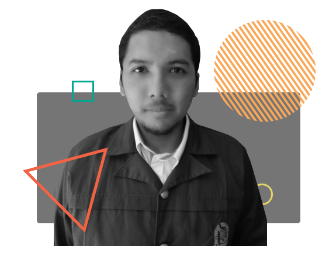

### 💬 Introduction

#### Hi There 👋, I'm Bayu. A Student who interested in Web Development

My name is Bayu Samudra. I'm from Indonesia. Currently, I study at Institut Teknologi Bandung. I like exploring Web Development and build some projects for my exercise. Nice to meet you.

### 🔭 My Projects

| No. | Project                                     | Year       |
|:---:| ------------------------------------------- |:----------:|
| 1.  | [Parade Wisuda Oktober ITB 2021](https://www.paradewisudaitb.com/) | 2021 |
| 2.  | Ganesha Prize 2021 Website | 2021 |
| 3.  | [Suka Makan](https://sukamakan.bayusamudra.my.id) | 2021 |
| 4.  | [Iklanlive](https://iklanlive.com/)         | 2022       |
| 5.  | [SPARTA 2021](https://spartahmif.com/)      | 2022       |

### 🌱 Tools and Skills

### 📫 Contact
Feel free to touch me on my email [contact@bayusamudra.my.id](mailto:contact@bayusamudra.my.id).

### 📝 Credits
All media above above was adapted from Wikimedia. (CC BY-SA 4.0)

<!--
**bayusamudra5502/bayusamudra5502** is a ✨ _special_ ✨ repository because its `README.md` (this file) appears on your GitHub profile.

Here are some ideas to get you started:

- 🔭 I’m currently working on ...
- 🌱 I’m currently learning ...
- 👯 I’m looking to collaborate on ...
- 🤔 I’m looking for help with ...
- 💬 Ask me about ...
- 📫 How to reach me: ...
- 😄 Pronouns: ...
- ⚡ Fun fact: ...
-->
